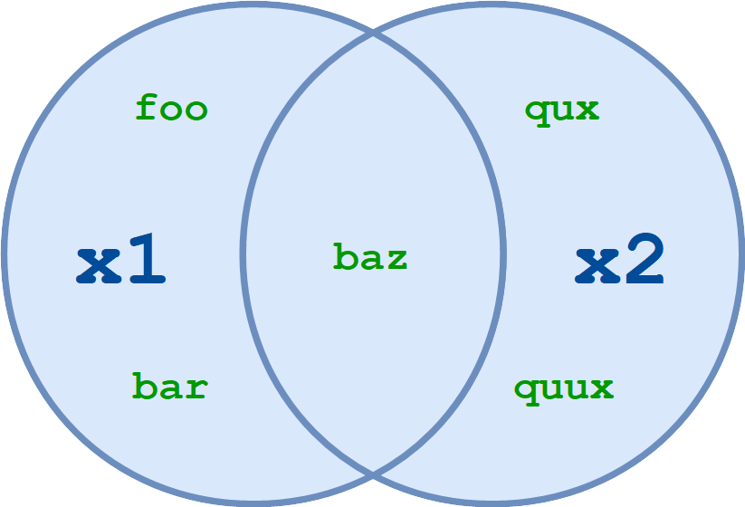

# Coding Practices for DevOps (Python)

**Note:** All examples were executed on:

```
Python 3.8.2 (default, Aug 25 2020, 09:23:57) 
[Clang 12.0.0 (clang-1200.0.32.2)] on darwin
```

# Agenda

```
# Environment
  * Virtual Environment
  * "virtualenvwrapper"-helper
  * Packages Management (using "pip")
  * requirements.txt
  * Code Auto-Formatting
  * IDE
 
# Data-Structures
  * Tuple
  * Named Tuple
  * List
  * Dictionary
  * Set
 
# Control Flow
  * for-loop
  * while-loop
  * if-statement
 
# Iterators and Generators
  * iterators
  * generators
 
# Exceptions
 
# Files
  * Text Files
  * Binary Files
 
# Functions
  * Arguments, optional arguments, passing by value / reference
  * Function as generator
  * Using "partial" and "lru_cache" helpers

# Decorators

# Logging
 
# Useful Helpers
```

# Environment

## Virtual Environment

Virtual environment - is an isolated set of installed packages / modules for your application

**Note:** From my experience, I strictly recommend freezing your packages' versions to source control,
because no guarantee of package's compatibility from version to version

## Install `virtualenvwrapper`-helper

I could recommend to use [`virtualenvwrapper`-helper](https://virtualenvwrapper.readthedocs.io/en/latest/install.html)
to simplify virtual environment setup for your projects

```bash
pip3 install virtualenvwrapper
mkdir $HOME/.virtualenvs
```

Usually, I use a separate folder for all virtual environments (export it in `$HOME/.bashrc`-file):

```bash
export WORKON_HOME=$HOME/.virtualenvs
export VIRTUALENVWRAPPER_PYTHON=/usr/bin/python3  # Result of `which python3`
```

Run `python3`:

```python
import virtualenvwrapper

# List all available attributes and methods for `virtualenvwrapper`-module
dir(virtualenvwrapper)
# ['__doc__', '__file__', '__loader__', '__name__', '__package__', '__path__', '__spec__']

# Look for the module's path
virtualenvwrapper.__path__
# _NamespacePath(['/Users/vantonevych/Library/Python/3.8/lib/python/site-packages/virtualenvwrapper'])
```

List all files from Python's `bin` folder:

```bash
ls /Users/vantonevych/Library/Python/3.8/bin
...
virtualenvwrapper.sh
virtualenvwrapper_lazy.sh
```

Also, add `virtualenvwrapper.sh` to `$HOME/.bashrc`:

```bash
source /Users/vantonevych/Library/Python/3.8/bin/virtualenvwrapper.sh
```

When apply the changes to your terminal's session:

```bash
source $HOME/.bashrc
```

## Create Virtual Environment

To create virtual environment, execute:

```bash
mkvirtualenv project1
# created virtual environment CPython3.8.2.final.0-64 in 696ms
#     added seed packages: pip==20.2.4, setuptools==50.3.2, wheel==0.35.1
# ...
# (project1) vantonevych-mbp:~ vantonevych$   <-- You could see a prefix with you virtual environment's name
```

To use the specific version of Python you should add the `--python` command line option:

```bash
mkvirtualenv project2 --python /Users/vantonevych/.virtualenvs/project1/bin/python3
```

BTW, there are a lot of additional options for `mkvirtualenv`-command, read the documentation

## Install Packages

You could simply install the packages to your virtual environment:

```bash
pip install requests
```

[Black](https://pypi.org/project/black/) auto-formatting tool:

```bash
pip install black==20.8b1
```

## Freeze Packages

To review all installed packages, use:

```bash
pip freeze

# ...
# black==20.8b1
# ...
# requests==2.25.1
# ...
# urllib3==1.26.2
```

A best practice is **to store** all your installed packages into some file, usually called `requirements.txt`
and **push** that file **into source control repository**:

```bash
pip freeze > requirements.txt
```

## Restore Packages

To restore your environment, execute:

```bash
pip install -r requirements.txt
```

## Useful Tips and Tricks

You could specify your custom repository in `requirements.txt`, like:

```
# Usually on the top of the file

-i https://pypi.python.org/simple
-i https://my-python-artifactory.company.com/simple

idna==2.10
...
```

When you have more than one `requirements.txt`-like files (for example: `base.txt`, `testing.txt`, `profiling.txt`, etc),
you could simply reference/include them to avoid duplication, example for `profiling.txt`:

```
# Include base/generic requirements
-r base.txt
# Include testing libraries
-r testing.txt

# Profiling packages
memory-profiler~=0.58.0  # This directive could install version `0.58.0`, `0.58.1` or `0.58.10`, etc.
...
```

## Upgrade Packages

Example of `requirements.txt` with "about/near" version specified:

```
urllib3~=1.26.0
```

Current status of packages using `pip freeze`:

```
urllib3==1.26.0
```

Upgrade packages to the latest version:

```bash
pip install -r requirements.txt --upgrade
# Successfully installed urllib3-1.26.2
```

BTW, the `urllib3-1.26.2` version also will be installed for new virtual environment from the scratch

## Code Auto-Formatting (using `black`-tool)

[PEP 8 -- Style Guide for Python Code](https://www.python.org/dev/peps/pep-0008/)

The [black](https://pypi.org/project/black/) tool is re-formatting files in place (rewrites files).
You could run it before your commit to repository.

```bash
pip install black
black -t py37 -v app_folder1 app_folder2 tests
black --target-version py38 app_folder1/ app_folder2/ tests/ setup.py
```

Using configuration file named `pyproject.toml`:

```ini
[tool.black]
line-length = 120
target-version = ['py38']
```

```bash
# Run in the same folder where configuration file is located 
black *.py

# Run from any folder
black --config=/Users/vantonevych/projects/lambda/pyproject.toml /Users/vantonevych/projects/lambda/server_creation_request.py
```

Verify a code style only (useful for CI/CD pipeline, will fail when re-formatting is required):

```bash
black --check *.py
```

## IDE

* [PyCharm](https://www.jetbrains.com/pycharm/)
* [kite](https://www.kite.com/)
* [Visual Studio Code](https://code.visualstudio.com/)
* Others

## To Read

* [How to Write Beautiful Python Code With PEP 8](https://realpython.com/python-pep8/)

# Data-Structures

Data structures are the fundamental constructs around which you build your programs.
Each data structures provide a particular way of organizing data, so it can be **accessed efficiently**,
depending on your use case. Python ships with an extensive set of data structures in its standard library.

* [Common Python Data Structures (Guide)](https://realpython.com/python-data-structures/)

## [Tuple](https://docs.python.org/3/tutorial/datastructures.html#tuples-and-sequences)

Tuple is [immutable type](https://docs.python.org/3/glossary.html#term-immutable) object.
An object with a fixed value. A new object has to be created if a different value has to be stored.

Example: use immutable types as a key in a dictionary

```python
t1 = (1, 2, 3)  # Store numbers
t2 = (1, "s", "5", False)  # Store number, strings, boolean 
t3 = ([3, 4, 5], {"key": "value"})  # Store complex types as list and dict
```

The `t3`-tuple is still **immutable**, because it's storing a **pointer to python's object**, not values itself.

**Pointers** are widely used in C and C++.
Essentially, they are variables that hold **the memory address of another variable**. 


Values are stored in separate attributes inside python's object.
So, pointer to dict or list remains the same during its lifetime.

### Unpack Tuple

```python
t1 = (100, 200, 300)
num1, num2, num3 = t1
print(num1, num2, num3)
# 100 200 300
```

Unpack tuple as function's arguments:

```python
def f(num1, num2, num3):
    print(num1, num2, num3)

t1 = (100, 200, 300)
f(*t1)
# 100 200 300

t2 = (500, 600)
f(1000, *t2)
# 1000 500 600
```

Use tuple as a function's argument with unknown amount of actual arguments inside:

```python
def f(a1, a2, *args):  # `*args` can be only at the end of arguments' list
    print("a1:", a1, "a2:", a2)
    print("args:", args)

f(1, 2, 3, 4, 5)
# a1: 1 a2: 2
# args: (3, 4, 5) <-- is a tuple

f("name", "age", "Some", "additional", "argument", 42)
# a1: name a2: age
args: ('Some', 'additional', 'argument', 42)
```

### To Read

* [Pointers in Python: What's the Point?](https://realpython.com/pointers-in-python/)

## [Named Tuple](https://docs.python.org/3/library/collections.html#collections.namedtuple)

Signature:

```
collections.namedtuple(typename, field_names, *, rename=False, defaults=None, module=None)
```

Returns a new tuple subclass named **typename**. The new subclass is used to create tuple-like objects that have
fields accessible by attribute lookup as well as being indexable and iterable.

Examples:

```python
from collections import namedtuple

Project = namedtuple('Project', ['code', 'name', 'repo_url'])
project1 = Project("facebook", "Link the World", "https://bitbucket.com/facebook.git")
print(project1.name)
# Link the World

print(project1)
# Project(code='facebook', name='Link the World', repo_url='http://bitbucket.com/facebook.git')

print(type(project1))
# <class '__main__.Project'>

# You can't modify attribute
project1.name = "new_name"
# AttributeError: can't set attribute

# But you could replace the attribute and new tuple will be created
copy_project1 = project1._replace(name='Sell personal data')
print(copy_project1)
# Project(code='facebook', name='Sell personal data', repo_url='http://bitbucket.com/facebook.git')
print(project1)  # Remains the same
# Project(code='facebook', name='Link the World', repo_url='http://bitbucket.com/facebook.git')

project2 = Project(repo_url="https://gitlab.com/jenkins.git", name="Run everything", code="jenkins")
print(project2.code)
# jenkins

# Reference by index: `[-1]` means - give me the last one attribute from `Project`-definition ('repo_url')
print(project2[-1])
# https://gitlab.com/jenkins.git

# Reference by index: `[0]` means - give me the first one attribute from `Project`-definition ('code')
print(project2[0])
# jenkins

# Other ways to define the type
Project = namedtuple('Project', ('code', 'name', 'repo_url'))

Project = namedtuple('Project', 'code, name, repo_url')

Project = namedtuple('Project', 'code name repo_url')
```

**Limitation**:
You **can't use** [Python keywords](https://docs.python.org/3/reference/lexical_analysis.html#keywords) as a field name:

```python
from collections import namedtuple

Project = namedtuple('Project', ('class', 'name', 'repo_url'))
# ValueError: Type names and field names cannot be a keyword: 'class'
```

### To Read

* [collections.namedtuple](https://docs.python.org/3/library/collections.html#collections.namedtuple)
* [Python Tutorial: Namedtuple - When and why should you use namedtuples?](https://www.youtube.com/watch?v=GfxJYp9_nJA)
* [Immutable Data Structures: Tuples](https://realpython.com/lessons/immutable-data-structures-tuples/)

## [List](https://docs.python.org/3/tutorial/datastructures.html#more-on-lists)

### Data Structure

It's an array of pointers to `PyObject`, one continuous piece of memory is used.

`O(1)` to search by index, `O(n)` to search by value.

Contains some free space and `capacity`-counter. If `length == capacity`, a new bigger piece of memory will be allocated
(`~ current length * 1.3`) and all data will be copied to this new memory. This is a 'heavy'-operation.

### Usage

Lists are written within square brackets `[]`

Lists store an ordered collection of items which can be of different types.

```python
l = [3, True, 'Michael', 2.0]
# This list contains an int, a bool, a string, and a float.
```

Each item in a list has an **assigned index value**. It is important to note that python is a **zero indexed based**
language (the first item in the list is at index `0`).

```python
l = [3, True, 'Michael', 2.0]

# list:           [3, True, 'Michael', 2.0]
# index:          [0,    1,         2, 3  ]
# negative index: [-4,  -3,        -2, -1 ]

print(l[2], l[0])
# Michael 3

# Use indexing from the end of list: `-1` is the last element in list
print(l[-1], l[-3])
# 2.0 True
```

You could select a **part of the list**  using **slicing**-operation
`[::]`:

```python
l = list(range(10))
print(l)
# [0, 1, 2, 3, 4, 5, 6, 7, 8, 9]

# Syntax:
# list_instance[<start index, included>:<end index, excluded!>]

print(l[0:2])
# [0, 1]
print(l[1:5])
# [1, 2, 3, 4]
print(l[:2])  # Empty means from the start of the list
# [0, 1]
print(l[6:])  # Empty means till the end of the list
# [6, 7, 8, 9]
print(l[:])  # Whole list. TRICK: creates a list's copy
# [0, 1, 2, 3, 4, 5, 6, 7, 8, 9]
print(l[::3])  # Third parameter means take every X-element only when `index / X == 0`
# [0, 3, 6, 9]
print(l[::-1])  # TRICK: create a new, reversed list 
# [9, 8, 7, 6, 5, 4, 3, 2, 1, 0]
print(l[::-2])
# [9, 7, 5, 3, 1]

# ATTENTION:
print(l[:5])
# [0, 1, 2, 3, 4]
# BUT will start from the end of list until reaches element with index `6`
print(l[:5:-1])
# [9, 8, 7, 6]
```

Add an element to the list:

```python
l = list(range(5))
print(l)
# [0, 1, 2, 3, 4]

# Add an element to the end of the list
l.append(777)
l.append(888)
# [0, 1, 2, 3, 4, 777, 888]

# Append another list to the end of the list
l.extend([999, 1010])
# [0, 1, 2, 3, 4, 777, 888, 999, 1010]

# Pop element by index
l.pop(1)
# [0, 2, 3, 4, 777, 888, 999, 1010]

# Pop a first element into variable
first_element = l.pop(0)
# [2, 3, 4, 777, 888, 999, 1010]
# first_element = 0

# Pop a last one into variable
last_element = l.pop()
# [2, 3, 4, 777, 888, 999]
# last_element = 1010
```

### Sort

```python
l = [1, 5, 4, 3]
id(l)
# 4471062336

# Sort in place, list ID remains the same, but data is sorted
l.sort()
# [1, 3, 4, 5]
id(l)
# 4471062336

# Reversed sort in place
l.sort(reverse=True)
# [5, 4, 3, 1]

# Sort and create a NEW list
l1 = sorted(l)
# [1, 3, 4, 5]
id(l), id(l1)
# (4471058880, 4471060864)  # Different IDs

# Reversed sort and create a NEW list
sorted(l, reverse=True)
# [5, 4, 3, 1]
```

### Length, Whether List Is Empty

```python
l = []
print(len(l))
# 0

# Check if list is not empty
if l:
    print("Contains data")
else:
    print("Empty")
# Empty

# Use `if not l:` to check if list is empty
not l
# True

bool(l)
# False
```

### Comprehension

```python
l = list(range(1, 11))
# [1, 2, 3, 4, 5, 6, 7, 8, 9, 10]

# Create a new list with `*1000`-multiplier for each entry
l1000 = [entry * 1000 for entry in l]
# [1000, 2000, 3000, 4000, 5000, 6000, 7000, 8000, 9000, 10000]

# Create a new list contains only elements which divide by 5
l_div_5 = [entry for entry in l if entry % 5 == 0]
# [5, 10]
```

List of dictionaries:

```python
l = [
    {
        "name": "facebook",
        "type": {"web"},  # This is a set
    },
    {
        "name": "MS Word",
        "type": {"application", "web"},  # This is a set
    },
    {
        "name": "MS Windows",
        "type": {"application"},
    },
    {
        "name": "AWS Lambda",
        "type": {"infrastructure"},
    },
]

# Select only applications
applications = [
    entry
    for entry in l
    if "application" in entry["type"]
]
# [{'name': 'MS Word', 'type': {'application', 'web'}}, {'name': 'MS Windows', 'type': {'application'}}]

# Select only applications, "name"-attribute
application_names = [
    entry["name"]
    for entry in l
    if "application" in entry["type"]
]
# ['MS Word', 'MS Windows']

# Check whether any "application"-type entry is in list
any(
    "application" in entry["type"]
    for entry in l
)
# True

# Check that all entries from list are "application"-type
all(
    "application" in entry["type"]
    for entry in l
)
# False

# Check that all entries from list contain "type"-attribute
all(
    "type" in entry
    for entry in l
)
# True

# Tuple ("name", "type") for every entry
[
    (entry["name"], t)
    for entry in l
        for t in entry["type"]
]
# [('facebook', 'web'), ('MS Word', 'application'), ('MS Word', 'web'), ('MS Windows', 'application'), ('AWS Lambda', 'infrastructure')]

# Extract ("name", "type")-tuple for every entry and filter by 'web'-type only
[
    (entry["name"], t)
    for entry in l
        for t in entry["type"] if t == "web"
]
# [('facebook', 'web'), ('MS Word', 'web')]

# MS application names only
[
    entry["name"]
    for entry in l if entry["name"].startswith("MS ")
        for t in entry["type"] if t == "application"
]
# ['MS Word', 'MS Windows']

# One more way do the same as above
[
    entry["name"]
    for entry in l
    if entry["name"].startswith("MS ") and "application" in entry["type"]
]
# ['MS Word', 'MS Windows']
```

### Iterate Element with Index

```python
# Index from 0
l = ["Google", "MS", "facebook"]
for index, entry in enumerate(l):
    print(index, entry)
# 0 Google
# 1 MS
# 2 facebook

# Index from 1
for index, entry in enumerate(l, start=1):
    print(index, entry)
# 1 Google
# 2 MS
# 3 facebook

# When you need only index
for index, _ in enumerate(l, start=100):
    print(index)
# 100
# 101
# 102
```

### List Into String

```python
l = ["Google", "MS", "facebook", "Intellias"]
s = ", ".join(l)
print(s)
# Google, MS, facebook, Intellias

l = [5, 6, 7, 8, 9]
s = ", ".join(str(entry) for entry in l)
print(s)
# 5, 6, 7, 8, 9

# List of tuples
l = [(1, "Google"), (5, "MS"), (8, "facebook"), (15, "Intellias")]
# Here we unpack tuple into `num` and `company` variables
s = "; ".join(f"{num}: {company}" for num, company in l)
print(s)
# '1: Google; 5: MS; 8: facebook; 15: Intellias'
```

### String Into List

```python
s = "COVID-19,COVID-20,COVID-21,etc."
l = s.split(",")
# ['COVID-19', 'COVID-20', 'COVID-21', 'etc.']

# Apply only 2 operations
l = s.split(",", 2)
# ['COVID-19', 'COVID-20', 'COVID-21,etc.']

s = "COVID-19, COVID-20, COVID-21, etc."
l = s.split(", ")
# ['COVID-19', 'COVID-20', 'COVID-21', 'etc.']
```

### List with Predefined Length and the Same Element

```python
l = [None] * 10
print(l)
# [None, None, None, None, None, None, None, None, None, None]
```

```python
from random import randint

l = [randint(0, 10)] * 10
print(l)
# [6, 6, 6, 6, 6, 6, 6, 6, 6, 6]
# NOTE: Unfortunately, `randint()` will be executed only once and its result will be copied

# As workaround
l = [randint(0, 10) for _ in range(10)]
# [10, 9, 8, 10, 2, 6, 0, 5, 2, 5]

l = [1, 2, 3] * 3
# [1, 2, 3, 1, 2, 3, 1, 2, 3]
```

### To Read

* [List Methods](https://realpython.com/lessons/list-methods/)
* [Python Lists and List Manipulation](https://towardsdatascience.com/python-basics-6-lists-and-list-manipulation-a56be62b1f95)
* [Python Lists and List Manipulation (Video)](https://youtu.be/w9I8R3WSVqc)
* [List Comprehensions and Built-In Functions on Lists](https://realpython.com/lessons/list-comprehensions-and-built-functions-lists/)
* [Writing Your First List Comprehension](https://realpython.com/lessons/writing-your-first-list-comprehension/)
* [List Comprehensions Overview](https://realpython.com/lessons/list-comprehensions-overview/)
* [Python Lists and Tuples Quiz](https://realpython.com/quizzes/python-lists-tuples/)

## [Dictionary](https://docs.python.org/3/tutorial/datastructures.html#dictionaries)

### Data Structure

Contains a [Hash table](https://en.wikipedia.org/wiki/Hash_table) data storage inside, with key <-> value pair, 
where key is immutable and [hashable](https://docs.python.org/3/glossary.html#term-hashable) object and value
is a pointer to `PyObject`.
One continuous piece of memory is used.


`O(1)` to search by key.

Contains some free space. If free space is lesser than `40%`, a new bigger piece of memory
will be allocated and copy all data to this new memory (with re-hashing).

```python
import sys

sys.getsizeof({})
# 64

d = {"a": 1, "b": 2}
sys.getsizeof(d)
# 232

d["c"] = 3
sys.getsizeof(d)
# 232

d["d"] = 4
d["e"] = 5
sys.getsizeof(d)
# 232

d["f"] = 6
sys.getsizeof(d)
# 360
```

### Useful Methods

Create a dictionary:

```python
d1 = {'a': 1, 'b': 2, 'c': 3}
# {'a': 1, 'b': 2, 'c': 3}
d2 = dict(a=1, b=2, c=3)
# {'a': 1, 'b': 2, 'c': 3}
d3 = dict(zip(("a", "b", "c"), (1 ,2, 3)))
# {'a': 1, 'b': 2, 'c': 3}
d4 = dict(a=list(range(100)), b={"k": "v"})
# {'a': [0, 1, 2, ..., 98, 99], 'b': {'k': 'v'}}

# Pretty print
from pprint import pprint, pformat
pprint(d4)
# {'a': [0,
#        1,
#        2,
#      ...,
#        99],
#  'b': {'k': 'v'}}

# Pretty format into string and print
print(pformat(d4, indent=4, width=120))
# {   'a': [   0,
#              1,
#              2,
#            ...,
#              98,
#              99],
#     'b': {'k': 'v'}}
```

Check whether some key is in a dictionary:

```python
d = {'a': 1, 'b': 2, 'c': 3}
'a' in d
# True

'd' in d
# False

'd' not in d
# True
```

Access to elements:

```python
d = {'a': 1, 'b': 2, 'c': 3}

len(d)
# 3

d.keys()
# dict_keys(['a', 'b', 'c'])

# It's an iterator!
d.keys()[-1]
# TypeError: 'dict_keys' object is not subscriptable

list(d.keys())[-1]
# 'c'

# It's an iterator!
d.values()
# dict_values([1, 2, 3])

# It's an iterator!
d.items()
# dict_items([('a', 1), ('b', 2), ('c', 3)])

"; ".join(f"{k}: {v}" for k, v in d.items())
'a: 1; b: 2; c: 3'

d["a"]
# 1

d["c"]
# 3

d["d"]
# KeyError: 'd'

d.get("a")
# 1

d.get("d")
# None

d.get("d", "default")
# 'default'

d["e"]
# KeyError: 'e'

d.setdefault("e", "default for e")
d["e"]
# 'default for e'

# See also `collections.defaultdict` below
```

Manipulate the elements:

```python
d = {'a': 1, 'b': 2, 'c': 3}

d['a'] = 100
# {'a': 100, 'b': 2, 'c': 3}

del d['a']
# {'b': 2, 'c': 3}

d.pop("d")
# KeyError: 'd'

d.pop("d", "default d")
# 'default d'

# Add new 'key' key
d["key"] = "value"
# {'b': 2, 'c': 3, 'key': 'value'}

# Add new 'a' key
d.update(a=1)
# {'b': 2, 'c': 3, 'key': 'value', 'a': 1}

# Update 'a' and 'c' keys, add 'e' key
d.update(a=2, c=300, e=True)
# {'b': 2, 'c': 300, 'key': 'value', 'a': 2, 'e': True}

# Update 'e' key, add 'f' key
d.update({'e': False, 'f': [1, 2, 3]})
# {'b': 2, 'c': 300, 'key': 'value', 'a': 2, 'e': False, 'f': [1, 2, 3]}
d['f'][-1]
# 3

d1, d2 = {"a": 1}, {"b": 2}
d1.update(d2)
d1
# {'a': 1, 'b': 2}
```

Delete the `dict`-object itself (to remove its reference and mark memory for garbage collection):

```python
d = {'a': 1, 'b': 2, 'c': 3}
d
# {'a': 1, 'b': 2, 'c': 3}

del d
d
# NameError: name 'd' is not defined
```

### Comprehension

Create a `dict` from another iterable-object:

```python
values = list(range(97, 105, 2))
# [97, 99, 101, 103]

# Create a character by its code
d = {chr(entry): entry for entry in values}
# {'a': 97, 'c': 99, 'e': 101, 'g': 103}

# The same result will be for command
d = {chr(entry): entry for entry in range(97, 105, 2)}

# Capitalize the fruit name and remove duplicates ('apple')
fruits = ['apple', 'banana', 'apricot', 'watermelon', 'apple', 'watermelon', 'watermelon']
d = {fruit: fruit.capitalize() for fruit in fruits}
# {'apple': 'Apple', 'banana': 'Banana', 'apricot': 'Apricot', 'watermelon': 'Watermelon'}

# Count of every fruits
from collections import Counter

d = dict(Counter(fruits))
# {'apple': 2, 'banana': 1, 'apricot': 1, 'watermelon': 3}
```

### Helpers from [`collections`](https://docs.python.org/3/library/collections.html) Library

Dictionary with the specified default value:

```python
from collections import defaultdict

fruits = ['apple', 'banana', 'apricot', 'watermelon']
d = defaultdict(list)
# defaultdict(<class 'list'>, {})

for fruit in fruits:
    d[fruit[0]].append(fruit)
# defaultdict(<class 'list'>, {'a': ['apple', 'apricot'], 'b': ['banana'], 'w': ['watermelon']})

d['a']
# ['apple', 'apricot']

# Return default value for non-existing key
d['c']
# []

# Use integer as default value (`0`)
d = defaultdict(int)
d["a"]
# 0
```

The standard dictionary does not guarantee that elements will be returned in the same order as they added
(especially for python 2.X), so the [`collections.OrderedDict`](https://docs.python.org/3/library/collections.html#collections.OrderedDict)
were introduced to preserve that order.
(I would recommend using it for python 3 also, because internal `dict`-implementation could vary from an interpreter
and a platform)

```python
# Python 2.7.16 (default, Jun  5 2020, 22:59:21) 
d = {'c': 3, 'a': 1, 'b': 2}
d.items()
# [('a', 1), ('c', 3), ('b', 2)]

from collections import OrderedDict 
d = OrderedDict()
d["c"] = 3
d["a"] = 1
d["b"] = 2
d.items()
# [('c', 3), ('a', 1), ('b', 2)]
```

### To Read

* [Python Dictionary](https://www.programiz.com/python-programming/dictionary)
* [What Is a Dictionary in Python?](https://realpython.com/lessons/dictionary-python/)
* [collections.defaultdict](https://docs.python.org/3/library/collections.html#collections.defaultdict)
* [Defaultdict in Python](https://www.geeksforgeeks.org/defaultdict-in-python/)
* [collections.OrderedDict](https://docs.python.org/3/library/collections.html#collections.OrderedDict)
* [Data pretty printer](https://docs.python.org/3/library/pprint.html)
* [collections.Counter](https://docs.python.org/3/library/collections.html#collections.Counter)

## [Set](https://docs.python.org/3/tutorial/datastructures.html#sets)

### Data Structure

Python sets are implemented using dictionary with dummy variables,
where key beings the members set with greater optimizations to the time complexity.

### Useful Methods

Create a set:

```python
s = {1, 2, 3}
print(s)
# {1, 2, 3}

print(s.__class__)
# <class 'set'>

# Set from list
s = set([1, 2, 3, 3, 2, 1, 1, 4])
# {1, 2, 3, 4}
```

Element in set:

```python
s = {1, 2, 3}
print(2 in s)
# True

print(4 in s)
# False
```

Element not in set:

```python
s = {1, 2, 3}
print(2 not in s)
# False

print(4 not in s)
# True
```

Example: Check whether all command line arguments `args` are in expected `environments`-set:

```python
# Define environments set
environments = {"dev", "qa", "stg", "prod"}

# Define arguments, actually they come from `sys.argv`
args = ["DEV ", "Stg", "qa"]
# Use set-comprehension to convert arguments-list to set
args_set = {arg.strip().lower() for arg in args}
# {'stg', 'dev', 'qa'}

# Check whether each environment from `args_set` is correct
all(env in environments for env in args_set)
# True

# Check whether each environment from `args_set` is correct:
# Use set's difference operation (remove all the elements from `args_set` which are the same in `environments`,
# the result set must be empty):
args_set - environments
# set()

not bool(args_set - environments)
# True

invalid_test_env_set = {'stg', 'dev', 'qa', 'test'}

# The 'test'-element is absent in environments
invalid_test_env_set - environments
# {'test'}

# One more way: using union for two sets, a new set must be the same as `environments`:
args_set | environments
# {'prod', 'stg', 'qa', 'dev'}

args_set | environments == environments
# True

invalid_test_env_set | environments
# {'qa', 'test', 'prod', 'stg', 'dev'}

invalid_test_env_set | environments == environments
# False

# Use intersection of two sets, result set contains elements which are the same for both sets
args_set & environments
# {'stg', 'dev', 'qa'}

args_set & environments == args_set
# True

invalid_test_env_set & environments
# {'stg', 'dev', 'qa'}

invalid_test_env_set & environments == invalid_test_env_set
# False

# Using `issubset()` method (or `<=`-operand)
args_set.issubset(environments)
# True
args_set <= environments
# True

invalid_test_env_set.issubset(environments)
# False
invalid_test_env_set <= environments
# False

# What the environment is not expected:

# * using the difference
invalid_test_env_set - environments
# {'test'}

# * using the intersection and then the difference
invalid_test_env_set - (invalid_test_env_set & environments)
# {'test'}

# * using the union and then the difference
(invalid_test_env_set | environments) - environments
# {'test'}

# * using the symmetric difference and then the difference
(invalid_test_env_set ^ environments) - environments
# {'test'}
```

### Operations

* Compute the union of two or more sets
  
  `x1.union(x2[, x3 ...])` or `x1 | x2 [| x3 ...]`
  
  

* Compute the intersection of two or more sets

  `x1.intersection(x2[, x3 ...])` or `x1 & x2 [& x3 ...]`
  
  

* Compute the difference between two or more sets

  `x1.difference(x2[, x3 ...])` or `x1 - x2 [- x3 ...]`
  
  

* Compute the symmetric difference between sets
  (is the set of elements which are in either of the sets, but not in their intersection)
  
  `x1.symmetric_difference(x2)` or `x1 ^ x2 [^ x3 ...]`
  
  

### Modification

Modify set example:

```python
environments = {"dev", "qa", "stg", "prod"}

environments.add("test")
# {'qa', 'test', 'prod', 'stg', 'dev'}

environments.remove("stg")
# {'qa', 'test', 'prod', 'dev'}

environments.remove("stg")
# KeyError: 'stg'

environments.discard("stg")
# No exception here

environments.pop()
# 'qa'

environments
# {'test', 'prod', 'dev'}
```

### [frozenset](https://docs.python.org/3/library/stdtypes.html?highlight=frozenset#frozenset)

Python provides another built-in type called a `frozenset`, which is in all respects exactly like a set,
except that a `frozenset` is immutable.

Example:

```python
s = {1, 2, 3}
d = {}

# You can't use set as key in dictionary
d[s] = 1
# TypeError: unhashable type: 'set'

fs = frozenset([1, 2, 3])
# frozenset({1, 2, 3})

fs.add(4)
# AttributeError: 'frozenset' object has no attribute 'add'

# You can use frozenset as key in dictionary 
d[fs] = 1
# {frozenset({1, 2, 3}): 1}
```

### To Read

* [Hashing | Set 1 (Introduction)](https://www.geeksforgeeks.org/hashing-set-1-introduction/)
* [Sets in Python](https://realpython.com/python-sets/)
* [Frozen Sets](https://realpython.com/python-sets/#frozen-sets)
* [Sets in Python](https://www.geeksforgeeks.org/sets-in-python/)
* [Sets and Frozen Sets in Python - Elucidate Their Similarities and Differences](https://medium.com/swlh/sets-and-frozen-sets-in-python-elucidate-their-similarities-and-differences-ef0df006ca46)

# Control Flow

## [`for`-loop](https://docs.python.org/3/tutorial/controlflow.html?highlight=loops#for-statements)

Python's `for`-statement iterates over the items of any sequence (a list or a string, etc.),
in the order that they appear in the sequence.

Example:

```python
l = ["Hello", 2, "World", 4, "!", 10.34]
message = ""

for entry in l:
    if message:
        message += " "

    message += str(entry)
    
print(message)
# Hello 2 World 4 ! 10.34

message = ""

for i, entry in enumerate(l):
    if not isinstance(entry, str):
        print("Entry:", entry, "under index", i, "is not a string")
        continue  # <-- This command starts loop over
    
    message += entry + " "

# Entry: 2 under index 1 is not a string
# Entry: 4 under index 3 is not a string
# Entry: 10.34 under index 5 is not a string

print(message)
# Hello World ! 

for i, entry in enumerate(l):
    if isinstance(entry, int):
        first_int = i, entry
        break  # <-- This command breaks the loop execution
else:
    first_int = None, None  # <-- This command is executed when any `break`-occurs


number, index = first_int
if number is not None:
    print("First integer is found:", number, "under index", index)
# First integer is found: 1 under index 2

# Replace array with and test again
l = ["Hello", 2.1, "World", 4.2, "!", 10.34]
# Prints nothing, so a `first_int` is not found
```

## `while`-loop

Example of `while`-loop using some counter/index:

```python
def while_loop(count):
    while count > 0:  # Will be executed while condition is `True`
        print("Count", count)
        count -= 1


while_loop(3)
# Count 3
# Count 2
# Count 1

while_loop(0)
# No output
```

Example of infinite loop:

```python
from random import randint


def infinite_while():
    count = 0

    while True:
        i = randint(0, 5)
        print("i:", i)
        count += 1
        
        if i == 0:
            break

    print("Loop is finished, count of iterations:", count)


infinite_while()
# i: 0
# Loop is finished, count of iterations: 1

infinite_while()
# i: 3
# i: 5
# i: 3
# i: 4
# i: 1
# i: 1
# i: 2
# i: 0
# Loop is finished, count of iterations: 8
```

Loop using boolean variable:

```python
from random import randint


def bool_while():
    count = 0
    zero_found = False

    while not zero_found:
        i = randint(0, 5)
        print("i:", i)
        count += 1
        
        zero_found = (i == 0)

    print("Loop is finished, count of iterations:", count)


bool_while()
# i: 5
# i: 3
# i: 1
# i: 0
# Loop is finished, count of iterations: 4
```

Loop using condition:

```python
from random import randint


def conditional_while():
    count = 0
    i = None
    while i != 0:
        i = randint(0, 5)
        print("i:", i)
        count += 1

    print("Loop is finished, count of iterations:", count)


conditional_while()
# i: 5
# i: 2
# i: 2
# i: 0
# Loop is finished, count of iterations: 4
```

Search for something and set default value when not found:

```python
from random import randint


def search_for(number):
    l = [randint(0, 10) for _ in range(10)]
    print("l:", l)

    index = 0
    while index < len(l):
        if l[index] == number:
            print("Index found:", index, "for number:", number)
            break

        index += 1
    else:
        # Will be here when `while`-loop is finished and any `break` was executed
        print("Index is not found for number: ", number)   


search_for(0)
# l: [0, 10, 1, 6, 7, 10, 2, 8, 3, 2]
# Index found: 0 for number: 0

search_for(7)
# l: [8, 3, 5, 7, 8, 9, 7, 8, 9, 2]
# Index found: 3 for number: 7

search_for(17)
l: [10, 10, 4, 9, 3, 3, 4, 0, 3, 2]
# Index is not found for number:  17
```

The `else` section always be executed when `break`-command does not happen, even when loop's condition is `False`
from the beginning:

```python
counter = 0

while counter > 0:
    print("counter:", counter)
    if counter == 1000:
        print("Stop loop")
        break
else:
    print("else executed")
# else executed
```

## [`if ... elif ... else`](https://docs.python.org/3/tutorial/controlflow.html?highlight=loops#if-statements)

```python
def positive_integer(x):
    if x < 0:
        x = 0
        print('Negative changed to zero')
    elif x == 0:
        print('Zero')
    elif x == 1:
        print('Single')
    else:
        print('More')
        
    return x


print("Result:", positive_integer(-10))
# Negative changed to zero
Result: 0

positive_integer(1)
# Single

positive_integer(100)
# More

positive_integer(0)
# Zero
```

## To Read

* [Loops in Python](https://www.geeksforgeeks.org/loops-in-python/)
* [More Control Flow Tools](https://docs.python.org/3/tutorial/controlflow.html)

# Iterators and Generators

There are many types of objects which can be used with a `for`-loop.
These are called **iterable** objects.

## The `iter`-function

The built-in function `iter` takes an iterable object and returns an iterator.

```python
l = [1, 2, 3]
l.__class__
# <class 'list'>

i = iter(l)
i.__class__
# <class 'list_iterator'>

next(i)
# 1
next(i)
# 2
next(i)
# 3
next(i)
# Traceback (most recent call last):
#   File "<input>", line 1, in <module>
# StopIteration

dir(i)
['__class__', ..., '__iter__', '__next__', ]
```

## An Iteration Protocol

The `__iter__` method is what makes an object iterable.
Behind the scenes, the `iter`-function calls `__iter__`-method on the given object.

The return value of `__iter__` is an iterator. It should have a `__next__`-method and raise `StopIteration` 
when there are no more elements.

```python
class IntRange:
    def __init__(self, n):
        self.i = 0
        self.n = n

    def __iter__(self):
        return self

    def __next__(self):
        if self.i < self.n:
            i = self.i
            self.i += 1
            return i
        else:
            raise StopIteration()


i = IntRange(3)
next(i)
# 0
next(i)
# 1
next(i)
# 2
next(i)
# Traceback (most recent call last):
#   File "<input>", line 1, in <module>
#   File "<input>", line 15, in __next__
# StopIteration

# A `for`-loop automatically catches the `StopIteration`-exception
for i in IntRange(2):
    print(i)

# 0
# 1
```

## The [`itertools.chain`](https://docs.python.org/3/library/itertools.html#itertools.chain) helper

Make an iterator that returns elements from the first iterable until it is exhausted, then proceeds
to the next iterable, until all of the iterables are exhausted.

```python
from itertools import chain

list(chain('ABC', 'DEF'))
# ['A', 'B', 'C', 'D', 'E', 'F']

list(chain([1, 2, 3], [5, 2, 7], [3, 8]))
# [1, 2, 3, 5, 2, 7, 3, 8]

list(chain([1, 2, [3, 4, 0]], [5, 2, 7], [3, 8]))
# [1, 2, [3, 4, 0], 5, 2, 7, 3, 8]
```

The [`itertools.groupby`](https://docs.python.org/3/library/itertools.html#itertools.groupby) helper

Make an iterator that returns consecutive keys and groups from the iterable.
The key is a function computing a key value for each element.
If not specified or is `None`, key defaults to an identity function and returns the element unchanged.
Generally, the iterable needs to already be sorted on the same key function.

```python
from itertools import groupby

students = [
    {'mark': '65', 'grade': 'C'},
    {'mark': '86', 'grade': 'A'},
    {'mark': '73', 'grade': 'B'},
    {'mark': '49', 'grade': 'D'},
    {'mark': '91', 'grade': 'A'},
    {'mark': '79', 'grade': 'B'}
]

# Sort `students`-list by grade
students = sorted(students, key=lambda x: x['grade'])
# [{'mark': '86', 'grade': 'A'}, {'mark': '91', 'grade': 'A'}, {'mark': '73', 'grade': 'B'}, 
#  {'mark': '79', 'grade': 'B'}, {'mark': '65', 'grade': 'C'}, {'mark': '49', 'grade': 'D'}]

for grade, entries in groupby(students, key=lambda x: x['grade']):
    print("Grade:", grade, "Entries:", entries)

# Grade: A Entries: <itertools._grouper object at 0x10ff14cd0>
# Grade: B Entries: <itertools._grouper object at 0x10fd9a8e0>
# Grade: C Entries: <itertools._grouper object at 0x10ff14cd0>
# Grade: D Entries: <itertools._grouper object at 0x10ff145b0> # <-- Prints `itertools._grouper` instead of values

for grade, entries in groupby(students, key=lambda x: x['grade']):
    print("Grade:", grade, "Entries:", list(entries))  # <-- Convert `itertools._grouper` into list

# Grade: A Entries: [{'mark': '86', 'grade': 'A'}, {'mark': '91', 'grade': 'A'}]
# Grade: B Entries: [{'mark': '73', 'grade': 'B'}, {'mark': '79', 'grade': 'B'}]
# Grade: C Entries: [{'mark': '65', 'grade': 'C'}]
# Grade: D Entries: [{'mark': '49', 'grade': 'D'}]

for grade, entries in groupby(students, key=lambda x: x['grade']):
    print("Grade:", grade, "Count of entries:", len(list(entries)))
# Grade: A Count of entries: 2
# Grade: B Count of entries: 2
# Grade: C Count of entries: 1
# Grade: D Count of entries: 1


from operator import itemgetter 

for grade, entries in groupby(students, key=itemgetter('grade')):
    print("Grade:", grade, "Max mark:", max(entries, key=itemgetter('mark'))['mark'])
# Grade: A Max mark: 91
# Grade: B Max mark: 79
# Grade: C Max mark: 65
# Grade: D Max mark: 49
```

## Generators

**Generator** is calculating the next function's result "on the fly" based on some algorithm,
or reads result from external storage (like a file, database, etc.)

So, generator is also an iterator. You don't have to worry about the iterator protocol.

Example of generator's comprehension:

```python
l = [1, 2, 3]
g = (i**2 for i in l)
# <generator object <genexpr> at 0x10f1dc970>
next(g)
# 1
l1 = list(g)
# [4, 9]  # <-- Here as you can see we continue with next values after `1`.
          # If you want to start over, you have to create a new generator
```

Function as generator will be discussed in **Functions**-section

## To Read

* [Iterators & Generators](https://anandology.com/python-practice-book/iterators.html)
* [Python Tutorial: Iterators and Iterables - What Are They and How Do They Work?](https://www.youtube.com/watch?v=jTYiNjvnHZY)
* [Python Tutorial: Generators - How to use them and the benefits you receive](https://www.youtube.com/watch?v=bD05uGo_sVI)
* [itertools — Functions creating iterators for efficient looping](https://docs.python.org/3/library/itertools.html)
* [How to Use Generators and yield in Python](https://realpython.com/introduction-to-python-generators/)

# Exceptions

## [Exception hierarchy](https://docs.python.org/3/library/exceptions.html#exception-hierarchy)

```
BaseException
 +-- SystemExit
 +-- KeyboardInterrupt
...
 +-- Exception
      +-- StopIteration
      ...
      +-- OSError
      ...
      |    +-- ConnectionError
      |    |    +-- BrokenPipeError
      |    |    +-- ConnectionAbortedError
      |    |    +-- ConnectionRefusedError
      |    |    +-- ConnectionResetError
      |    +-- FileExistsError
      |    +-- FileNotFoundError
      ...
      +-- RuntimeError
      |    +-- NotImplementedError
      |    +-- RecursionError
      ...
      +-- TypeError
      +-- ValueError
      |    +-- UnicodeError
      ...
```

## `try ... except ... else ... finally`


```python
def str_to_int(value):
    result = None
    
    try:
        if not isinstance(value, str):
            raise TypeError("String type is required")

        result = int(value)
    except TypeError:
        print("TypeError, re-raise it")
        raise
    except ValueError as e:
        print("ValueError", e, "raise with a new message")
        raise ValueError(f"Can't convert to integer: {value}")
    else:
        print("Value is successfully converted:", result)
        return result
    finally:
        print("Function is completed")


str_to_int({})
# TypeError, re-raise it
# Function is completed
# Traceback (most recent call last):
#   File "<input>", line 1, in <module>
#   File "<input>", line 6, in str_to_int
# TypeError: String type is required

str_to_int("aaa")
# ValueError invalid literal for int() with base 10: 'aaa' raise with a new message
# Function is completed
# Traceback (most recent call last):
#   File "<input>", line 8, in str_to_int
# ValueError: invalid literal for int() with base 10: 'aaa'
#
# During handling of the above exception, another exception occurred:
# 
# Traceback (most recent call last):
#   File "<input>", line 1, in <module>
#   File "<input>", line 14, in str_to_int
# ValueError: Can't convert to integer: aaa

str_to_int("10")
# Value is successfully converted: 10
# Function is completed
# 10
```

## User Defined Exceptions

```python
class ValidationError(ValueError):
    def __init__(self, attribute, error, *args, **kwargs):
        # First argument is `message`
        # Transfer all other arguments to base exception
        super().__init__(f"{attribute}: {error}", *args, **kwargs)


try:
    raise ValidationError("account_id", "Account ID is required")
except ValidationError as e:
    print("ValidationError", e)
except ValueError as e:
    print("ValueError", e)
# ValidationError account_id: Account ID is required
```

**NOTE:** Exception is processed in the same order as defined in `except`-statements 

```python
try:
    raise ValidationError("account_id", "Account ID is required")
except ValueError as e:
    print("ValueError", e)
except ValidationError as e:
    print("ValidationError", e)
# ValueError account_id: Account ID is required
```

```python
try:
    raise ValidationError("account_id", "Account ID is required")
except Exception as e:
    print("Exception", e)
except ValueError as e:
    print("ValueError", e)
except ValidationError as e:
    print("ValidationError", e)
# Exception account_id: Account ID is required
```

You could use **more than one base class** for your custom defined exception:

```python
class ValidationError(ValueError, RuntimeError):
    def __init__(self, attribute, error, *args, **kwargs):
        # First argument is `message`
        # Transfer all other arguments to base exception
        super().__init__(f"{attribute}: {error}", *args, **kwargs)


try:
    raise ValidationError("account_id", "Account ID is required")
except ValueError as e:
    print("ValueError", e)
# ValueError account_id: Account ID is required

try:
    raise ValidationError("account_id", "Account ID is required")
except RuntimeError as e:
    print("RuntimeError", e)
# RuntimeError account_id: Account ID is required
    
try:
    raise ValidationError("account_id", "Account ID is required")
except NotImplementedError as e:
    print("NotImplementedError", e)
# Traceback (most recent call last):
#   File "<input>", line 2, in <module>
# ValidationError: account_id: Account ID is required
```

## Define Custom Exceptions Hierarchy

Example:

```python
class ApplicationError(RuntimeError):
    pass


class ValidationError(ApplicationError):
    pass


class ExternalApiError(ApplicationError):
    pass


class ServiceError(ApplicationError):
    pass


class DockerError(ServiceError):
    pass


class KubernetesError(ServiceError):
    pass


try:
    raise KubernetesError # some error is raised here
except DockerError:
    print("DockerError")
except ServiceError:
    print("Other service error")
except ExternalApiError:
    print("Call to external API is failed")
except ValidationError:
    print("Invalid input data")
except ApplicationError:
    print("Some application error is occurred")
except Exception:
    print("Unexpected error is occurred")
except:
    print("System error is occurred")
# Other service error
```

For the same code as above, but:
```python
try:
    raise KeyboardInterrupt
...
# System error is occurred
```

The `KeyboardInterrupt` exception inherits from `BaseException` so as to not be accidentally caught by code that 
catches `Exception` and thus prevent the interpreter from exiting.

See [KeyboardInterrupt](https://docs.python.org/3/library/exceptions.html#KeyboardInterrupt)

## Suppress an Exception

You could suppress one or more exceptions using 
[contextlib.suppress](https://docs.python.org/3/library/contextlib.html#contextlib.suppress) helper:

```python
import os
from contextlib import suppress

with suppress(FileNotFoundError):
    os.remove('somefile.tmp')
```

This code is equivalent to:

```python
import os

try:
    os.remove('somefile.tmp')
except FileNotFoundError:
    pass
```

One more example:

```python
from contextlib import suppress

d = {"a": "1a"}
with suppress(KeyError, ValueError):
    print(d["b"])
# prints nothing

with suppress(KeyError, ValueError):
    print(int(d["a"]))
# prints nothing

with suppress(ValueError):
    print(int(d["b"]))
# Traceback (most recent call last):
#  File "<input>", line 2, in <module>
# KeyError: 'b'

with suppress(Exception):
    print(int(d["b"]))
# prints nothing
```

## Tip: Use [`NotImplementedError`](https://docs.python.org/3/library/exceptions.html#NotImplementedError) for Undefined Behaviour or Abstract Methods

Example for **undefined behaviour**:

```python
entity = {"type": "application"}

if entity["type"] == "application":
    pass
elif entity["type"] == "infrastructure":
    pass
else:
    raise NotImplementedError(f'Unexpected entity type: {entity["type"]}')
```

Or when you are implementing some function:

```python
def process_entity(entity):
    if entity["type"] == "application":
        pass
    elif entity["type"] == "infrastructure":
        pass
    
    raise NotImplementedError(f'Unexpected entity type: {entity["type"]}')
```

Example for **abstract method**:

```python
class Attribute:
    def __init__(self, value):
        self._value = value
        
    def validate(self):
        pass

    
class IntegerAttribute(Attribute):
    pass
    

class AccountID(IntegerAttribute):
    pass


account_id = AccountID("1000")
account_id.validate()
# Do nothing, silently skipping a validation process. This is a source for unexpected behaviour
```

Replace the `Attribute`-class definition with:

```python
class Attribute:
    def __init__(self, value):
        self._value = value
        
    def validate(self):
        raise NotImplementedError("Must be defined in descendant")


# Traceback (most recent call last):
#   File "<input>", line 2, in <module>
#   File "<input>", line 6, in validate
# NotImplementedError: Must be defined in descendant
```

Example with calling parent's method, using `super()`:

```python
class Attribute:
    def __init__(self, value):
        self._value = value
        
    def validate(self):
        raise NotImplementedError("Must be defined in descendant")

    
class IntegerAttribute(Attribute):
    def validate(self):
        try:
            self._value = int(self._value)
        except (ValueError, TypeError):
            raise ValueError("Invalid integer")
    

class AccountID(IntegerAttribute):
    def validate(self):
        super().validate()
        if not (1000000 <= self._value < 10000000):
            raise ValueError("Invalid account ID")


AccountID("1000aaa").validate()
# ValueError: Invalid integer

AccountID("1000").validate()
# ValueError: Invalid account ID

account_id = AccountID("1000000")
account_id.validate()
# No error here

print(account_id._value)
# 1000000

print(type(account_id._value))
# <class 'int'>
```

## To Read

* [Errors and Exceptions](https://docs.python.org/3/tutorial/errors.html)
* [Built-in Exceptions](https://docs.python.org/3/library/exceptions.html)
* [Python Custom Exceptions](https://www.programiz.com/python-programming/user-defined-exception)
* [Exceptions in Python || Python Tutorial || Learn Python Programming](https://www.youtube.com/watch?v=nlCKrKGHSSk)
* [Exception and Error Handling in Python](https://www.datacamp.com/community/tutorials/exception-handling-python)

# Files

## Text Files

[Example](files/text.txt):

```
Line 1
Line 2
```

### Read Whole Content

```python
def read_file(filename):
    with open(filename) as stream:
        return stream.read()

print(read_file("files/text.txt"))
# Line 1
# Line 2
#
```

### Read All Lines

**Note:** Line's separator is also included in result

```python
def read_file(filename):
    with open(filename) as stream:
        return stream.readlines() 

print(read_file("files/text.txt"))
# ['Line 1\n', 'Line 2\n']

for line in read_file("files/text.txt"):
    print(line.rstrip())  # Strips any whitespaces from the right side
# Line 1
# Line 2
# 
```

### Read Line by Line

Sometimes developer needs to process very long file line by line and read whole content is not reasonable
(for example, custom CSV-file, log files, etc.) 

**Note:** Line's separator is also included in result

```python
def read_file(filename):
    with open(filename) as stream:
        while True:
            line = stream.readline()
            if not line:
                break
            
            yield line

for index, line in enumerate(read_file("files/text.txt"), start=1):
    print(f"{index}:", line.rstrip())  # Strips any whitespaces from the right side
# 1: Line 1
# 2: Line 2
#
```

## Binary Files

### Use [`pickle`-Module](https://docs.python.org/3/library/pickle.html) to Store Objects

This is the preferred way to serialize Python objects (for example: for debugging purposes,
for storing data between sessions, for transferring python objects between processes, etc.)

```python
import pickle

filename = "example.pickle"

# Write data into binary file
with open(filename, mode="wb") as stream:
    pickle.dump([1, 2 ,3], stream)
    pickle.dump({"a": 1, "b": 2, "c": 3}, stream)
    pickle.dump(123, stream)
    pickle.dump(456.789, stream)
    pickle.dump("some example", stream)

# Read data from pickle-file
with open(filename, mode="rb") as stream:
    print(pickle.load(stream))
    print(pickle.load(stream))
    print(pickle.load(stream))
    print(pickle.load(stream))
    print(pickle.load(stream))
# [1, 2, 3]
# {'a': 1, 'b': 2, 'c': 3}
# 123
# 456.789
# some example
```

### Use [`struct`-Module](https://docs.python.org/3.8/library/struct.html) to Store Data

```python
import struct

encoding = "utf-8"
s = struct.Struct("l 20s 20s i")  # long, char[20], char[20], integer
packed = s.pack(
    1_000_000_000, 
    bytearray(source="Surname", encoding=encoding), 
    bytearray(source="Name", encoding=encoding), 
    1
)
print(packed)
# b'\x00\xca\x9a;\x00\x00\x00\x00Surname\x00\x00\x00\x00\x00\x00\x00\x00\x00\x00\x00\x00\x00Name\x00\x00\x00\x00\x00\x00\x00\x00\x00\x00\x00\x00\x00\x00\x00\x00\x01\x00\x00\x00'

print(s.unpack(packed))
# (1000000000, b'Surname\x00\x00\x00\x00\x00\x00\x00\x00\x00\x00\x00\x00\x00', b'Name\x00\x00\x00\x00\x00\x00\x00\x00\x00\x00\x00\x00\x00\x00\x00\x00', 1)

print(len(s.unpack(packed)[1].decode(encoding)))
# 20  # Spacers are still in our string

print(len(s.unpack(packed)[1].decode(encoding).rstrip('\x00')))
# 7
print(s.unpack(packed)[1].decode(encoding).rstrip('\x00'))
# Surname
```

Example with `dataclass`:

```python
import struct
from ctypes import c_ulong, c_ushort
from dataclasses import dataclass


@dataclass
class Student:
    PACK = struct.Struct("l 20s 20s i")
    ENCODING = "utf-8"

    identity: c_ulong
    surname: str
    name: str
    grade: c_ushort
    
    @classmethod
    def to_struct(cls, data):
        return cls.PACK.pack(
            data.identity, 
            bytearray(source=data.surname, encoding=cls.ENCODING),
            bytearray(source=data.name, encoding=cls.ENCODING),
            data.grade
        )
    
    @classmethod
    def from_struct(cls, data):
        unpacked = cls.PACK.unpack(data)
        result = Student(
            identity=unpacked[0],
            surname=unpacked[1].decode(cls.ENCODING).rstrip('\x00'),
            name=unpacked[2].decode(cls.ENCODING).rstrip('\x00'),
            grade=unpacked[3]
        )
        return result


data = [
    Student(identity=1_000_000_000, surname="Student 1", name="Petro", grade=8),
    Student(identity=1_000_000_001, surname="Student 2", name="Adriano", grade=7),
    Student(identity=1_000_000_100, surname="Student 3", name="Mykolaj", grade=10),
]

filename = "example.struct"
with open(filename, mode="wb") as stream:
    for entry in data:
        stream.write(Student.to_struct(entry))


with open(filename, mode="rb") as stream:
    while True:
        data = stream.read(Student.PACK.size)
        if not data:
            break
            
        print(Student.from_struct(data))
# Student(identity=1000000000, surname='Student 1', name='Petro', grade=8)
# Student(identity=1000000001, surname='Student 2', name='Adriano', grade=7)
# Student(identity=1000000100, surname='Student 3', name='Mykolaj', grade=10)
```

## Temporary Files

```python
import json
from tempfile import NamedTemporaryFile

def store_to_temporary_file(data):
    with NamedTemporaryFile(prefix="data-", suffix=".json", mode="w", encoding="utf-8", delete=False) as output:
        json.dump(data, output, ensure_ascii=False, indent=4)
    
    return output.name


print(store_to_temporary_file({"a": 1, "b": 2}))
# /var/folders/kx/fvf79l0n62zcwmc8fycwwl9rbnvdrx/T/data-2qdxuw9n.json

# cat /var/folders/kx/fvf79l0n62zcwmc8fycwwl9rbnvdrx/T/data-2qdxuw9n.json
# {
#    "a": 1,
#    "b": 2
# }
```

## To Read

* [Reading and Writing Files in Python (Guide)](https://realpython.com/read-write-files-python/)
* [The Python pickle Module: How to Persist Objects in Python](https://realpython.com/python-pickle-module/)
* [struct – Working with Binary Data](https://pymotw.com/2/struct/)
* [dataclasses — Data Classes](https://docs.python.org/3/library/dataclasses.html)
* [Data Classes in Python 3.7+ (Guide)](https://realpython.com/python-data-classes/)
* [tempfile — Generate temporary files and directories](https://docs.python.org/3/library/tempfile.html)

# Functions

## Without Arguments

```python
def f():
    print("f() is called")

    
f()
# f() is called
```

## With Arguments

```python
def f(arg):
    print("f() is called with argument:", arg)

    
f("aaa")
# f() is called with argument: aaa

f(True)
# f() is called with argument: True

f()
# TypeError: f() missing 1 required positional argument: 'arg'
```

## With Optional Named Arguments

```python
def f(arg, optional_arg="Optional Value"):
    print("f() is called with argument:", arg, "optional argument:", optional_arg)

f("aaa")
# f() is called with argument: aaa optional argument: Optional Value

f("aaa", 100)
# f() is called with argument: aaa optional argument: 100
```

The best practice is **always specify the name** for your optional **named** arguments:

```python
def f(firstname="Joe", lastname="Doe"):
    print("Firstname:", firstname, "Lastname:", lastname)


f()
# Firstname: Joe Lastname: Doe

f("Volodya", "A.")
# Firstname: Volodya Lastname: A.

f(lastname="A.", firstname="Volodya")
# Firstname: Volodya Lastname: A.
```

Someone modified the function: added one more optional argument **at the beginning** of arguments list:

```python
def f(code="111", firstname="Joe", lastname="Doe"):
    print("Code:", code, "Firstname:", firstname, "Lastname:", lastname)

f()  # <-- Works as expected
# Code: 111 Firstname: Joe Lastname: Doe

f("Volodya", "A.")  # <-- Unexpected behaviour
# Code: Volodya Firstname: A. Lastname: Doe

f(lastname="A.", firstname="Volodya")  # <-- Works as expected
# Code: 111 Firstname: Volodya Lastname: A.
```

## Pass Function's Arguments **By Value** and **By Reference**

For immutable types: pass **by value**

```python
def f(arg):
    print("Inside f, before modification:", arg)
    arg = 3
    print("Inside f, after modification:", arg)

    
v = 100
f(v)
# Inside f, before modification: 100
# Inside f, after modification: 3

print("After f:", v)
# After f: 100  <-- NOTE: Left the same as before function's call
```

To fix that, return the result's value from the function, like:

```python
def f(arg):
    print("Inside f, before modification:", arg)
    arg = 3
    print("Inside f, after modification:", arg)

    return arg


v = 100
v = f(v)
# Inside f, before modification: 100
# Inside f, after modification: 3

print("After f:", v)
# After f: 3  <-- As expected
```

For mutable types: pass **by reference**

```python
def f(l):
    if isinstance(l, list):
        l.append("aaa")
        return
    
    raise ValueError(f"List is expected, got {type(l).__name__}")


d = {}
f(d)
# ValueError: List is expected, got dict

print(d)
# {}

mylist = [1, 2, 3]
f(mylist)
print(mylist)
# [1, 2, 3, 'aaa']  <-- New entry was appended to the list
```

Be careful with **optional named arguments** and **mutable** objects:

```python
import random

def f(d={}, l=[]):  # Instance of `{}` and `[]` will be created **only once** per runtime
    v = random.randint(1, 1000)
    d[str(v)] = v
    l.append(v)

    print("d:", d, "l:", l)

f()  # Works as expected
# d: {'191': 191} l: [191]
f.__defaults__
# ({'191': 191}, [191])
 
f()  # Error: Expected 1 value, got 2
# d: {'191': 191, '786': 786} l: [191, 786]
f.__defaults__
# ({'191': 191, '786': 786}, [191, 786])

f()  # Error: Expected 1 value, got 3
# d: {'191': 191, '786': 786, '257': 257} l: [191, 786, 257]
f.__defaults__
# ({'191': 191, '786': 786, '257': 257}, [191, 786, 257])
```

Workaround, use `None` as a **default value** and create a mutable **instance inside a function**:

```python
import random

def f(d=None, l=None):
    if d is None:
        d = {}
    
    l = [] if l is None else l  # Short declaration

    v = random.randint(1, 1000)
    d[str(v)] = v
    l.append(v)

    print("d:", d, "l:", l)


f()
# d: {'809': 809} l: [809]
f.__defaults__
# (None, None)

f()
# d: {'76': 76} l: [76]

f()
# d: {'809': 809} l: [809]

mydict, mylist = {}, None
f(mydict, mylist)
# d: {'254': 254} l: [254]

print("mydict:", mydict, "mylist:", mylist)
# mydict: {'254': 254} mylist: None  # NOTE: Unexpected behaviour `mylist` is None

mydict, mylist = {}, []
f(mydict, mylist)
# d: {'659': 659} l: [659]

print("mydict:", mydict, "mylist:", mylist)
# mydict: {'659': 659} mylist: [659]

f(mydict, mylist)
# d: {'659': 659, '574': 574} l: [659, 574]

print("mydict:", mydict, "mylist:", mylist)
# mydict: {'659': 659, '574': 574} mylist: [659, 574]
```

## Modify the Global Variable Inside a Function Using `global`-keyword

```python
v = 100

def f():
    v = 999
    print("Inside f, after modification:", v)

print("Before f:", v)
# Before f: 100

f()
# Inside f, after modification: 999

print("After f:", v)
# After f: 100  <-- Unexpected behaviour, the value of `v` left the same 
```

Workaround:

```python
v = 100

def f():
    global v
    v = 999
    print("Inside f, after modification:", v)

    
print("Before f:", v)
# Before f: 100

f()
# Inside f, after modification: 999

print("After f:", v)
# After f: 999  <-- Expected value 
```

## Return Multiple Results from Function

```python
def f():
    host = "localhost"
    port = 80

    return host, port


f()
# ('localhost', 80)  <-- Tuple is returned

t = f() 
print("host:", t[0], "port:", t[1])
# host: localhost port: 80

myhost, myport = f()
print("myhost:", myhost, "myport:", myport)
# myhost: localhost myport: 80
```

## Pass an Unknown Amount of Arguments

**NOTE:** The `args` and `kwargs` are the common names for such types of arguments

The type of `args` is a **tuple**, of `kwargs` is a **dictionary**

```python
def f(*args, **kwargs):  
    print("args:", args, "kwargs:", kwargs)


f(1, 2, 3)
# args: (1, 2, 3) kwargs: {}

f(1, 2, age=42, in_it=22)
# args: (1, 2) kwargs: {'age': 42, 'in_it': 22}
```

You could also **unpack objects** (like **list**, **tuple**) as an arguments' list
and **dictionary** as named arguments:

```python
def f(command, flags, silent=False, dry_run=False):  
    print("command:", command, "flags:", flags, "silent:", silent, "dry_run:", dry_run)


args = []
kwargs = {}

args.append("ls")  # command
args.append("-la -G")   # flags

kwargs["dry_run"] = True

f(*args, **kwargs)
# command: ls flags: -la -G silent: False dry_run: True

cols = 8
if cols > 0:
    args[1] += f" --tabsize {cols}"   # add one more flag

f(*args, **kwargs)
# command: ls flags: -la -G --tabsize 8 silent: False dry_run: True
```

## Function as Generator

Common function:

```python
def f():
    return [1, 10, 100]


f()
# [1, 10, 100]
```

Define simple generator (using `yield`-keyword):

```python
def f():
    yield 1
    yield 10
    yield 100

f()
# <generator object f at 0x103786120>

g = f()
next(g)  # <-- Returns value one by one
# 1
next(g)
# 10
next(g)
# 100
next(g)
# StopIteration

list(f())
# [1, 10, 100]

for e in f():  # Use in `for`-loop, `next()` is automatically called by interpreter
    print(e)
# 1
# 10
# 100
```

Rewrite using some algorithm:

```python
def f():
    value = 1
    while value <= 100:
        yield value
        value *= 10  # Function context remains the same here between calls


list(f())
# [1, 10, 100]
```

Rewrite using external storage (ex: `external_data`):

```python
from collections.abc import Iterable

def f(external_data):
    assert isinstance(external_data, Iterable), "Iterable object is required"
    
    for e in external_data:
        if e <= 1000: 
            yield e
        else:
            break

            
mylist = [1, 10, 100, 1000, 10000]
list(f(mylist))
# [1, 10, 100, 1000]

mylist = [9, 99, 999, 9999, 99999]
list(f(mylist))
# [9, 99, 999]

mytuple = (8, 88, 888, 8888)
for e in f(mytuple):
    print(e)
# 8
# 88
# 888

list(f("abc"))  # NOTE: String is also iterable (character by character)
# TypeError: '<=' not supported between instances of 'str' and 'int'

list(f(42.42))
# AssertionError: Iterable object is required
```

## Using `partial`-Helper

You could use [functools.partial](https://docs.python.org/3/library/functools.html#functools.partial) helper to create
function's alias with predefined arguments list:

```python
from functools import partial


def function_with_long_arguments_list(message, log_level="DEBUG", output="console", filename="stdout"):
    print(f"{output}:{filename} [{log_level}]: {message}")


log_to_console = partial(function_with_long_arguments_list, output="console", filename="stderr")
log_to_console("log message", log_level="INFO")
# console:stderr [INFO]: log message

log_to_console_info = partial(log_to_console, log_level="INFO")
log_to_console_info("test message")
# console:stderr [INFO]: test message

log_to_file = partial(function_with_long_arguments_list, output="file", filename="/tmp/app.log")
log_to_file("log message", log_level="ERROR")
# file:/tmp/app.log [ERROR]: log message

log_to_file_error = partial(log_to_file, log_level="ERROR")
# file:/tmp/app.log [ERROR]: log message
```

## Using `lru_cache`-Helper

You could cache your function's results depends on arguments list using
[functools.lru_cache](https://docs.python.org/3/library/functools.html#functools.lru_cache):

```python
from functools import lru_cache
from time import sleep
from datetime import datetime


@lru_cache(maxsize=None)  # If maxsize is set to `None`, the LRU feature is disabled and the cache can grow without bound
def multiply(a, b):
    print(f"{datetime.now()} multiply starts")
    sleep(2)
    result = a * b 
    print(f"{datetime.now()} multiply ends")
    return result


multiply(1, 1)
# For first call:
# 2021-01-18 18:39:27.232212 multiply starts
# 2021-01-18 18:39:29.235126 multiply ends
# 1

# For second call, read result from cache:
# 1

multiply(1, 2)
# Calculate for another arguments list
# 2021-01-18 18:42:59.228399 multiply starts
# 2021-01-18 18:43:01.232634 multiply ends
# 2

# multiply(1, 1)
# Read result from cache
# 1

# multiply(1, 2)
# Read result from cache
# 2

multiply.cache_info()
# Shows cache info (attached to `multiply`-function) 
# CacheInfo(hits=3, misses=2, maxsize=None, currsize=2)

multiply.cache_clear()
# Clears cache

multiply.cache_info()
# Cache is empty now
# CacheInfo(hits=0, misses=0, maxsize=None, currsize=0)

multiply(1, 1)
# Calculates result again after cache have been cleared
# 2021-01-18 18:49:47.343147 multiply starts
# 2021-01-18 18:49:49.346703 multiply ends
# 1
```

BTW, there is a new [functools.cache](https://docs.python.org/3/library/functools.html#functools.cache) helper
added in `Python 3.9`

For caching class properties
[functools.cached_property](https://docs.python.org/3/library/functools.html#functools.cached_property) helper could
be used 

## To Read

* [Python Function Arguments](https://www.programiz.com/python-programming/function-argument)
* [Python args and kwargs: Demystified](https://realpython.com/python-kwargs-and-args/)
* [*args and **kwargs in Python](https://www.geeksforgeeks.org/args-kwargs-python/)
* [Python Generators](https://www.programiz.com/python-programming/generator)
* [Iterators](https://docs.python.org/3/howto/functional.html#functional-howto-iterators)
* [Iterators & Generators](https://anandology.com/python-practice-book/iterators.html)
* [Generators in Python](https://www.geeksforgeeks.org/generators-in-python/)

# [logging](https://docs.python.org/3/library/logging.html)

Use the `logging`-library to format your output in the same way for different scripts/tools.

```python
import logging

logger = logging.getLogger("my-tool")

LOG_FORMAT = "[%(asctime)s %(levelname)s] %(message)s"
LOG_DATE_FORMAT = "%Y-%m-%d %H:%M:%S"


def do_some_task():
    logger.info("Starting do some task...")
    
    try:
        logger.warning("Divide to 0 will cause an error")
        return 10 / 0
    except Exception:
        logger.exception("Some task is failed")
        
    logger.info("Some task is done")


if __name__ == "__main__":
    import sys

    # Default stream is `sys.stderr`
    logging.basicConfig(format=LOG_FORMAT, datefmt=LOG_DATE_FORMAT, level=logging.INFO, stream=sys.stdout)
    do_some_task()

# [2021-01-06 15:02:56 INFO] Starting do some task...
# [2021-01-06 15:02:56 WARNING] Divide to 0 will cause an error
# [2021-01-06 15:02:56 ERROR] Some task is failed
# Traceback (most recent call last):
#   File "<input>", line 6, in do_some_task
# ZeroDivisionError: division by zero
# [2021-01-06 15:02:56 INFO] Some task is done
```

See [LogRecord attributes](https://docs.python.org/3/library/logging.html#logrecord-attributes) for formatting your logs

See [logging.basicConfig documentation](https://docs.python.org/3/library/logging.html#logging.basicConfig)

You could change the `level` to `ERROR` for your custom `logger` in runtime,
see [Logging Levels](https://docs.python.org/3/library/logging.html#logging-levels):

```python
logger.setLevel(logging.ERROR)
# [2021-01-06 15:07:49 ERROR] Some task is failed
# Traceback (most recent call last):
#   File "<input>", line 6, in do_some_task
# ZeroDivisionError: division by zero
```

Also, you could change the `level` for **root**-`logger`:

```python
logging.getLogger().setLevel(logging.ERROR)
```

You could use any loggers as you need at the same time with separate configuration for it:

```python
import logging

TOOL = "my-tool"

logger = logging.getLogger(TOOL)

def do_some_task():
    logger.info("Starting do some task...")
    
    try:
        logger.warning("Divide to 0 will cause an error")
        return 10 / 0
    except Exception:
        logger.exception("Some task is failed")
        
    logger.info("Some task is done")


if __name__ == "__main__":
    import sys

    # Create logging handlers
    console_log = logging.StreamHandler(stream=sys.stdout)
    file_log = logging.FileHandler(f"{TOOL}.log")
    
    logger.setLevel(logging.DEBUG)  # Set lower level, because default is `WARNING`
    console_log.setLevel(logging.INFO)
    file_log.setLevel(logging.ERROR)
    
    console_log.setFormatter(logging.Formatter("%(name)s - %(levelname)s - %(message)s"))
    file_log.setFormatter(logging.Formatter("%(asctime)s - %(name)s - %(levelname)s - %(message)s"))
    
    # Add handlers to the logger
    logger.addHandler(console_log)
    logger.addHandler(file_log)

    do_some_task()

# Console output:
# my-tool - INFO - Starting do some task...
# my-tool - WARNING - Divide to 0 will cause an error
# my-tool - ERROR - Some task is failed
# Traceback (most recent call last):
#   File "<input>", line 13, in do_some_task
# ZeroDivisionError: division by zero
# my-tool - INFO - Some task is done

# Content of log file `cat my-tool.log`:
# 2021-01-06 15:28:25,381 - my-tool - ERROR - Some task is failed
# Traceback (most recent call last):
#   File "<input>", line 13, in do_some_task
# ZeroDivisionError: division by zero
```

Logging configuration could be stored in dictionary, load it using `dictConfig` method:

```python
import logging
from logging.config import dictConfig

logging_config = dict(
    version=1,
    formatters={
        'f': {'format': '%(asctime)s %(name)-12s %(levelname)-8s %(message)s'}
    },
    handlers={
        'h': {
            'class': 'logging.StreamHandler',
            'formatter': 'f',
            'level': logging.DEBUG
        }
    },
    root={
        'handlers': ['h'],
        'level': logging.DEBUG,
    },
)

dictConfig(logging_config)
```

Logging configuration also could be stored **in files**, examples:

**INI-file configuration**

```ini
[loggers]
keys=root,sampleLogger

[handlers]
keys=consoleHandler

[formatters]
keys=sampleFormatter

[logger_root]
level=DEBUG
handlers=consoleHandler

[logger_sampleLogger]
level=DEBUG
handlers=consoleHandler
qualname=sampleLogger
propagate=0

[handler_consoleHandler]
class=StreamHandler
level=DEBUG
formatter=sampleFormatter
args=(sys.stdout,)

[formatter_sampleFormatter]
format=%(asctime)s - %(name)s - %(levelname)s - %(message)s
```

**YAML-file configuration**

```yaml
version: 1
formatters:
  simple:
    format: '%(asctime)s - %(name)s - %(levelname)s - %(message)s'
handlers:
  console:
    class: logging.StreamHandler
    level: DEBUG
    formatter: simple
    stream: ext://sys.stdout
loggers:
  sampleLogger:
    level: DEBUG
    handlers: [console]
    propagate: no
root:
  level: DEBUG
  handlers: [console]
```

## To Read

* [logging](https://docs.python.org/3/library/logging.html)
* [Logging in Python](https://realpython.com/python-logging/)
* [Ultimate Guide to Logging](https://www.loggly.com/ultimate-guide/python-logging-basics/)
* [Example Configuration via a Dictionary](https://docs.python-guide.org/writing/logging/#example-configuration-via-a-dictionary)
* [Example Configuration via an INI File](https://docs.python-guide.org/writing/logging/#example-configuration-via-an-ini-file)
* [INI Configuration file format](https://docs.python.org/3/library/logging.config.html#configuration-file-format)
* [Logger From Dictionary (YAML File)](https://realpython.com/lessons/logger-dictionary/)

# Decorators

Decorator allows using declarative style of programming (syntactic sugar for declaring some attributes/behaviour). 
Some commonly used decorators that are even built-ins in Python are `@classmethod`, `@staticmethod`, and `@property` 

## Define Your Own Decorator

```python
def my_decorator(func):
    # Define inner function
    def wrapper():
        print("Before the function is called")
        func()
        print("After the function is called.")

    # Python also allows you to use functions as return value
    # Here it returns a pointer to function object
    return wrapper


def f():
    print("Inside f")
    

my_decorator(f)
# <function my_decorator.<locals>.wrapper at 0x10f1ee310>

# Execute returned function
my_decorator(f)()
# Before the function is called
# Inside f
# After the function is called.

# Do the same with the syntactic sugar
@my_decorator
def f():
    print("Inside f")


f()
# Before the function is called
# Inside f
# After the function is called.
```

## Function with Arguments

```python
def my_decorator(func):
    def wrapper():
        print("Before the function is called")
        func()
        print("After the function is called.")

    return wrapper


@my_decorator
def f(message):
    """`f` is a function"""
    print("Inside f:", message)


f("Hello")
# Traceback (most recent call last):
#  File "<input>", line 1, in <module>
# TypeError: wrapper() takes 0 positional arguments but 1 was given


def my_decorator(func):
    def wrapper(*args, **kwargs):
        print("Before the function is called")
        func(*args, **kwargs)
        print("After the function is called.")

    return wrapper


@my_decorator
def f(message):
    """`f` is a function"""
    print("Inside f:", message)


f("Hello")
# Before the function is called
# Inside f: Hello
# After the function is called.
```

## Show Correct Function's Attributes

```python
def f(message):
    """`f` is a function"""
    print("Inside f:", message)

    
f.__doc__
# '`f` is a function'


# Apply decorator to f()

def my_decorator(func):
    def wrapper(*args, **kwargs):
        """I'm wrapper"""
        print("Before the function is called")
        func(*args, **kwargs)
        print("After the function is called.")

    return wrapper


@my_decorator
def f(message):
    """`f` is a function"""
    print("Inside f:", message)

    
f.__doc__
# "I'm wrapper"


# Apply `wraps`-helper

from functools import wraps

def my_decorator(func):
    @wraps(func)
    def wrapper(*args, **kwargs):
        """I'm wrapper"""
        print("Before the function is called")
        func(*args, **kwargs)
        print("After the function is called.")

    return wrapper


@my_decorator
def f(message):
    """`f` is a function"""
    print("Inside f:", message)


f("DevOps knows Python")
# Before the function is called
# Inside f: DevOps knows Python
# After the function is called.
    
f.__doc__
# '`f` is a function'
```

## Stack of Decorators

```python
from functools import wraps


def decorator1(func):
    @wraps(func)
    def wrapper(*args, **kwargs):
        print("decorator1: Before the function is called")
        func(*args, **kwargs)
        print("decorator1: After the function is called.")

    return wrapper


def decorator2(func):
    @wraps(func)
    def wrapper(*args, **kwargs):
        print("decorator2: Before the function is called")
        func(*args, **kwargs)
        print("decorator2: After the function is called.")

    return wrapper


@decorator1
@decorator2
def f():
    print("Inside f")

# decorator1: Before the function is called
# decorator2: Before the function is called
# Inside f
# decorator2: After the function is called.
# decorator1: After the function is called.
```

## Decorator with Arguments

```python
from functools import wraps


def my_decorator_func(decorator_arg1, decorator_arg2):  # <-- Here are arguments for decorator function itself
    def inner(func):  # <-- Here is the pointer to function-for-decoration
        @wraps(func)
        def wrapper(*args, **kwargs):  # <-- Here are arguments to call our function-for-decoration
            print("Before:", decorator_arg1)
            func(*args, **kwargs)
            print("After:", decorator_arg2)
             
        return wrapper
    
    return inner


@my_decorator_func("Starting data processing...", "Data is processed successfully")
def f():
    """Data Processor"""
    print("Inside f")


f()
# Before: Starting data processing...
# Inside f
# After: Data is processed successfully

f.__doc__
# 'Data Processor'
```

## Real-World Example for Decorator with Arguments (Using Class)

The [`__call__`](https://docs.python.org/3/reference/datamodel.html#emulating-callable-objects) class method allows
emulating callable objects

```python
class A:
    def __init__(self, arg1):  # <-- Here is an argument for class initialization
        self._arg1 = arg1
      
    def __call__(self, message):  # <-- Here is an argument when instance behaves like a function 
        print("I'm a class and a function at the same time")
        print("class arg1:", self._arg1)
        print("Message:", message)


a = A("An Argument 1")  # Create an instance of class A with argument
a("Tsss.... This is secret message for __call__")  # Instance behaves like a function. Awesome!
# I'm a class and a function at the same time
# class arg1: An Argument 1
# Message: Tsss.... This is secret message for __call__
```

Decorator which prints function execution's time:

```python
import logging
import time

from functools import wraps

logger = logging.getLogger("tool")


class ExecutionTime:
    """Decorator responsible for writing to logs execution time of wrapped function"""

    def __init__(self, message):  # <-- Here is argument for decorator function itself
        self.message = message

    def __call__(self, func):  # <-- Here is the pointer to function-for-decoration
        @wraps(func)
        def wrapper(*args, **kwargs):  # <-- Here are arguments to call our function-for-decoration
            start_time = time.time()
            result = func(*args, **kwargs)
            end_time = time.time() - start_time

            if end_time >= 60:
                logger.debug("%s: %s minutes %s seconds", self.message, int(end_time / 60), int(end_time % 60))
            else:
                logger.debug("%s: %s seconds", self.message, int(end_time))

            return result

        return wrapper


@ExecutionTime("Total time taken to execute function")
def print_execution_time():
    time.sleep(1.53)


logging.basicConfig(
    level=logging.DEBUG,
    format="[%(levelname)s] %(asctime)s [%(name)16s:%(lineno)4s]: %(message)s"
)

print_execution_time()
# [DEBUG] 2021-01-29 12:09:23,587 [            tool:  17]: Total time taken to execute function: 1 seconds
```

## To Read:

* [Primer on Python Decorators](https://realpython.com/primer-on-python-decorators/)
* [functools.wraps](https://docs.python.org/3/library/functools.html#functools.wraps)
* [Python Decorator Tutorial with Example](https://dev.to/apcelent/python-decorator-tutorial-with-example-529f)
* [Decorators](https://python-3-patterns-idioms-test.readthedocs.io/en/latest/PythonDecorators.html)

# Useful Helpers

## [Context Manager Types](https://docs.python.org/3/library/stdtypes.html#context-manager-types)

Python's `with`-statement supports the concept of a runtime context defined by a context manager.
This is implemented using a pair of methods that allow user-defined classes to define a runtime context
that is entered before the statement body is executed and exited when the statement ends:

```python
# Define context manager class with `__enter__` and `__exit__` methods
class MyContextManager:
    def __init__(self):
        self.value = 42

    def __enter__(self):
        print("Creating resources")
        return self
    
    def __exit__(self, exc_type, exc_val, exc_tb):
        if exc_type:
            print("Exception occurred:", exc_val)

        print("Cleanup resources")


# Instantiate a `MyContextManager`-class
with MyContextManager():
    print("Validate request")
    raise ValueError("Invalid request")
    print("Do something")

# Creating resources
# Validate request
# Exception occurred: Invalid request
# Cleanup resources
# Traceback (most recent call last):
#   File "<input>", line 3, in <module>
# ValueError: Invalid request


# Instantiate a `MyContextManager`-class and store its value to variable
with MyContextManager() as manager:
    print("Validate request")
    print("The sense of life:", manager.value)
    print("Be healthy!")

# Creating resources
# Validate request
# The sense of life: 42
# Be healthy!
# Cleanup resources
```

## The [`contextmanager`](https://docs.python.org/3/library/contextlib.html#contextlib.contextmanager) helper

```python
import json
import tempfile
import shutil

from contextlib import contextmanager, suppress


@contextmanager
def create_config_json_file(file_prefix="db-config-"):
    tmp_dir = None
    try:
        print("Create resources")
        tmp_dir = tempfile.mkdtemp(prefix="my-app-")
        tmp_file = tempfile.mkstemp(suffix=".json", prefix=file_prefix, dir=tmp_dir, text=True)
        print("tmp_file:", tmp_file)
        
        yield tmp_file[1]
    finally:
        print("Cleanup resources")
        if tmp_dir:
            with suppress(OSError):
                shutil.rmtree(tmp_dir)


with create_config_json_file() as db_config_filename:
    with open(db_config_filename, mode="w", encoding="utf-8") as stream:
        data = {"server": "localhost", "port": 11188}
        
        json.dump(data, stream)
        print("Data is saved")
    
    with open(db_config_filename, mode="r", encoding="utf-8") as stream:
        print("Data from file:", stream.readlines())


# Create resources
# tmp_file: (14, '/var/folders/kx/fvf79l0n62zcwmc8fycwwl9rbnvdrx/T/my-app-hxplmp2l/db-config-fs8db2fh.json')
# Data is saved
# data in file: ['{"server": "localhost", "port": 11188}']
# Cleanup resources
```

## Redirect [stdout](https://docs.python.org/3/library/contextlib.html#contextlib.redirect_stdout) and [stderr](https://docs.python.org/3/library/contextlib.html#contextlib.redirect_stderr)

```python
import sys
from io import StringIO
from contextlib import redirect_stdout, redirect_stderr


def do_something():
    print("Hello")
    print("Error happens here", file=sys.stderr)
    print("Devops World!")
    print("Error Traceback: do_something did nothing", file=sys.stderr)

  
stdout_buffer, stderr_buffer = StringIO(), StringIO()

with redirect_stdout(stdout_buffer), redirect_stderr(stderr_buffer):
    #help(pow)
    do_something()
    
print("stdout:", stdout_buffer.getvalue())
# stdout: Hello
# Devops World!

print("stderr:", stderr_buffer.getvalue())
# stderr: Error happens here
# Error Traceback: do_something did nothing


stdout_buffer = StringIO()

with redirect_stdout(stdout_buffer):
    help(StringIO)

print("stdout:", stdout_buffer.getvalue())
# stdout: Help on class StringIO in module io:
# class StringIO(_TextIOBase)
#  |  StringIO(initial_value='', newline='\n')
#  |  
#  |  Text I/O implementation using an in-memory buffer.
# ...
```

# To Read

* [Real Python Tutorials](https://realpython.com/)
* [Modern Python Developer's Toolkit](https://pycon.switowski.com/)
* [Python 3 Module of the Week](https://pymotw.com/3/)
* [CPython Internals](https://github.com/zpoint/CPython-Internals)

